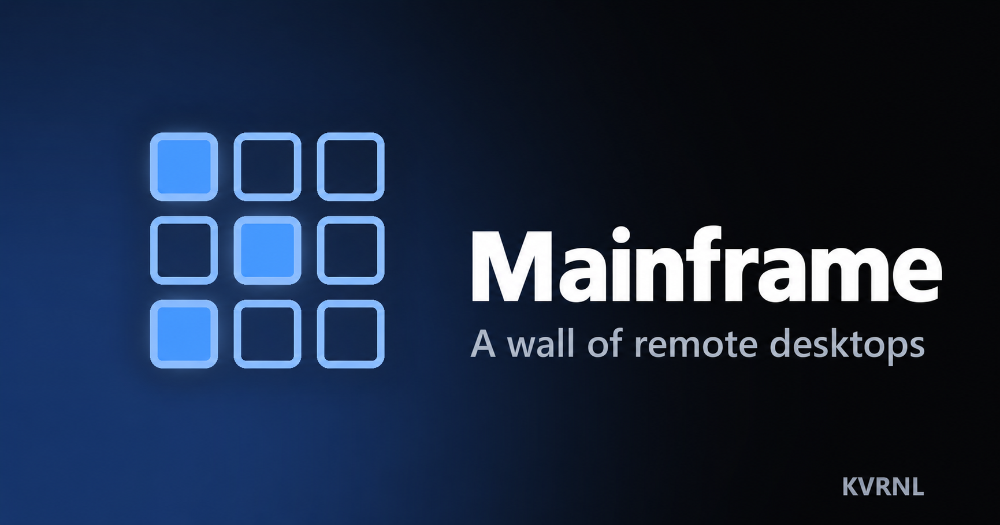

# Mainframe

### A wall of remote desktops

 

See up to 36 live remote-desktop connections at once in a clean grid — a security-camera wall for your PCs, servers, and VPSes. Every viewport is live but view-only; click one to take full control.

### **[⬇&nbsp; Download Mainframe — free at kvrnl.io](https://kvrnl.io/products/mainframe/)**

 

---

## What it does

Mainframe turns a pile of remote machines into a single wall you can watch at a glance. Add your PCs, servers, and VPSes and they appear as live RDP viewports in a grid you can size from 2×2 all the way to 6×6. The wall is view-only so nothing gets touched by accident; expand any tile for full control, go true-fullscreen, or yank a single screen out into its own free-floating desktop window and place it wherever you like.

A This-PC panel shows your own machine's address, name, and username so you always know exactly what to connect to, and a toast pops the moment any connection drops. Connections are saved with passwords encrypted by Windows and reconnect on launch. It runs from the system tray and updates itself silently. Free to use — claim your license key and download it straight from this page.

## Features

- **Live RDP wall, 2×2 up to 6×6, view-only by default**
- **Expand for full control, true-fullscreen, or pop out to a floating window**
- **This-PC panel + drop alerts so you're never guessing**
- **Saved connections (encrypted), tray, silent auto-updates**

## Download &amp; install

Mainframe is **completely free**. Each install needs its own license key, which you get
with a free KVRNL account.

1. Go to **[kvrnl.io/products/mainframe/](https://kvrnl.io/products/mainframe/)**
2. Create a free account — email verification, nothing else
3. Claim your license key — instant, no waiting
4. Download and install

> [!NOTE]
> Mainframe isn't code-signed yet, so Windows SmartScreen may warn you on first run.
> Click **More info → Run anyway**. Code signing is on the roadmap.

## Your license key

- **Free, one per product**, issued from your KVRNL account.
- **A key activates on one machine.** The first device to activate it claims it.
- **Switching computers?** Hit **Release device** on your
  [account page](https://kvrnl.io/account/) and the key is free to use again.
- Keys are checked over HTTPS at launch. See [Privacy](#privacy).

## Requirements

- **Windows 10 or 11** (64-bit)
- A free [KVRNL account](https://kvrnl.io/signup/) for your license key

## Privacy

Mainframe sends KVRNL only what's needed to validate your license: **the key, the
product name, and a hardware ID**. No telemetry, no analytics, no tracking, and
none of your files. Full policy: **[kvrnl.io/privacy](https://kvrnl.io/privacy/)**

## What's new

**v1.1.22** — 2026-09-25
  - Rebuilt the activation window for anyone who got Mainframe outside the KVRNL website. It explains that Mainframe is free and walks through getting a key step by step - create an account, get Mainframe from the store at no cost, and where your key shows up - with a button for each step and a Paste button for the key.
  - Every activation problem now says exactly what happened and what to do next - a key already active on another PC, a key for a different app, a typo, a suspended account - with a button that goes straight to the fix.
  - Fixed Mainframe asking to be activated again whenever the key server had a brief hiccup. Only a real answer about your key counts now; a server problem is treated like being offline, so your activation stays put.
  - Your activation is now tied to this PC, and working offline stays allowed for up to 14 days after the last successful check. The first time Mainframe starts after this update, it checks your key online once.
  - If checking your key takes a moment at startup, a small "Checking your license" window shows instead of nothing at all, and opening Mainframe a second time brings its window to the front. Setting up Remote Desktop now also needs Mainframe to be activated, and the automatic repair finds your key even when Windows asks for a different administrator account.

**v1.1.21** — 2026-09-25
  - Fixed the tray panel closing by itself - and sending an automatic error report - when you rested the pointer on one of its buttons. The button's tip took the keyboard focus as it appeared, and the panel read that as you clicking away.
  - Notifications, tips and the full-screen exit bar no longer pull the keyboard away from what you're doing. A notice popping up while you typed - in a remote session or any other app - could swallow your next keystrokes, and in full screen, moving the pointer near the top edge took the typing away from the remote PC.
  - The "someone is controlling your screen" bar no longer grabs the keyboard when it appears, so the first keys of the person you let in aren't lost, and a pinned tray panel no longer takes the focus when Mainframe starts.

**v1.1.20** — 2026-09-25
  - The tray panel has been rebuilt. Your screens now show as a row of small cards with a live or down light, anything wrong listed first - click a live one to jump straight into it, or a down one to try it again on the spot.
  - A status badge at the top says at a glance whether anything needs you, like a screen being down, Remote Desktop needing a fix or an update waiting. If someone is controlling this PC, a red banner takes over the top with a Take back button, and a waiting update gets its own card with Install.
  - Remote Desktop and Live Share are now quick tiles. The Live Share tile is its own on/off switch and lights up while sharing is on, and both tiles have a copy button for this PC's address or your share code.
  - The panel has smooth rounded corners on Windows 11, and the Mainframe name at the top no longer gets cut off.

**v1.1.19** — 2026-09-25
  - The icon by the clock now opens a small control panel instead of a bare menu. At a glance it shows whether your screens are live, whether other PCs can reach this one over Remote Desktop, whether Live Share is on and whether anyone is watching or in control, and whether an update is waiting - with the fix, switch or install button right beside each one.
  - Left-click and right-click on the icon both open the same panel, and it keeps everything the old menu had: open Mainframe, Settings, Report a problem and Quit. Hovering over the icon also shows a one-line status, such as how many of your screens are live.
  - The panel can be pinned. Drag it by its top to anywhere on your screen, or click its pin, and it stays open right there and on top of other windows - even after Mainframe restarts or updates - until you unpin it or close it with its X.
  - Opening Mainframe from the tray no longer shrinks a maximized window back to normal size.

**v1.1.18** — 2026-09-16
  - Fixed the Remote Desktop repair failing after a Windows update on PCs where a security product holds files open. The repair found the right settings for the new Windows build and verified them, but the final step - writing them into place - was refused by Windows and the failure was swallowed, so the old settings stayed live and Remote Desktop stayed down while every check said the data was correct. The write now falls back to the method that has always worked on these machines, retries through a short lock, and if it still can't land it says so plainly instead of reporting the wrong reason.

Full history → **[kvrnl.io/changelog/mainframe](https://kvrnl.io/changelog/mainframe/)**

## Documentation

Setup guides and how-tos → **[kvrnl.io/docs/mainframe](https://kvrnl.io/docs/mainframe/)**

## Support

> [!IMPORTANT]
> **We don't use GitHub Issues.** Report bugs from inside the app — it's the
> fastest route to us and it attaches the details we need automatically.

- 🐛 **Found a bug?** Use **Report a Problem** inside Mainframe
- 💬 **Chat with us** → **[Discord](https://discord.gg/Ub4SdAuhu)**
- ✉️ **Anything else** → **[kvrnl.io/contact](https://kvrnl.io/contact/)**
- ❓ **FAQ** → [kvrnl.io/faq](https://kvrnl.io/faq/)

## License

**Proprietary freeware — free to use, not open source.**

This repository hosts the installer releases, documentation, and license for
Mainframe. **The application source code is not published.** See
**[LICENSE](./LICENSE)** for the full terms.

---

 

**[kvrnl.io](https://kvrnl.io)** &nbsp;·&nbsp; **[All products](https://kvrnl.io/products/)** &nbsp;·&nbsp; **[Changelog](https://kvrnl.io/changelog/)** &nbsp;·&nbsp; **[Discord](https://discord.gg/Ub4SdAuhu)** &nbsp;·&nbsp; **[Contact](https://kvrnl.io/contact/)**

© 2026 <b>KVRNL</b> — an AI-powered software studio shipping free desktop tools.

